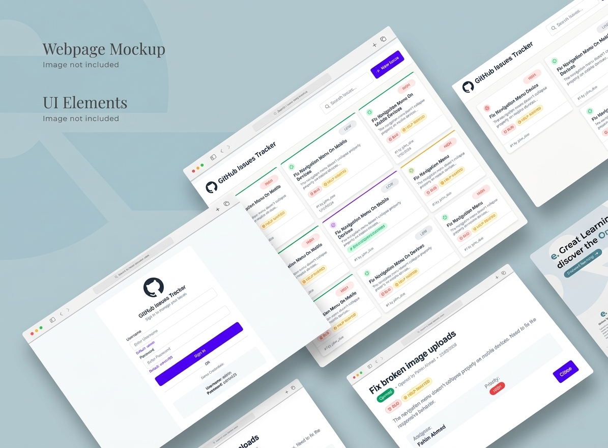
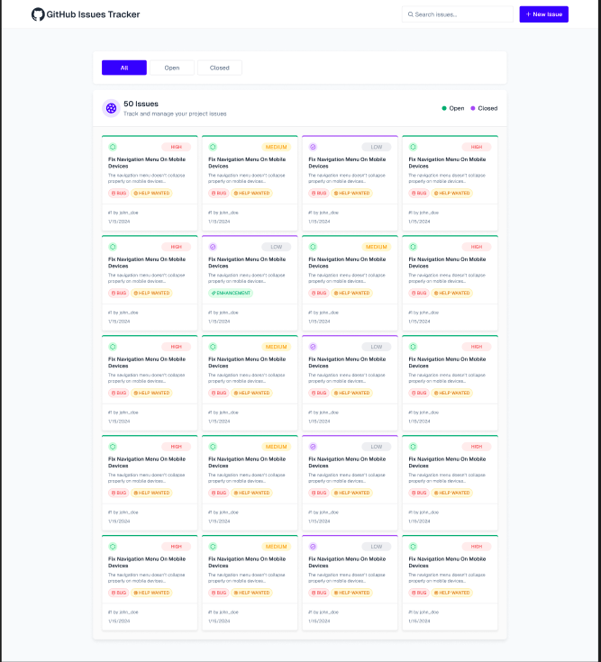
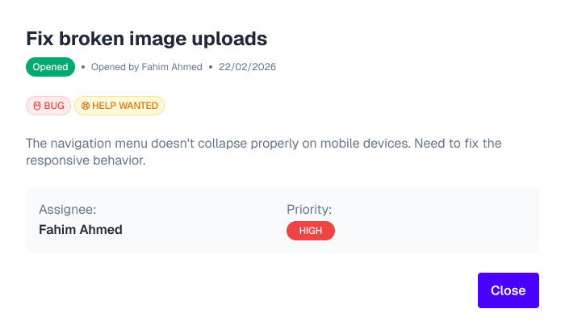

# 🐙 GitHub Issues Tracker

**A polished, responsive web application for managing your GitHub issues.** This project provides a clean and intuitive user interface to track, create, and manage issues efficiently.

---

## 🖼️ Project Mockup


---

## 🌟 Overview
The GitHub Issues Tracker is a frontend application that interacts with a mocked backend to manage project issues. It focuses on presenting issue data in a structured, readable format, complete with status indicators, priority labels, and assignee information.

---

## 📸 Screenshots

### 🔑 Authentication Page
Clean and secure login interface for project contributors.


### 📊 Dashboard & Issue Tracking
Main interface showing the grid layout, search functionality, and issue filters.


### 📝 Issue Details
Detailed view of individual issues with status and priority tags.


---

## 🛠️ Key Features

*   **Issue Grid View:** A structured grid layout displaying all current issues.
*   **Smart Filtering:** Quick tabs for "All", "Open", and "Closed" issues.
*   **Real-time Search:** Instantly filter issues by keywords in titles or descriptions.
*   **Responsive Design:** Fully optimized for Mobile, Tablet, and Desktop views.
*   **Priority System:** Color-coded labels (High, Medium, Low) for better task management.

---

## 💻 Tech Stack

*   **HTML5:** Semantic structure.
*   **Tailwind CSS:** For modern, utility-first styling and responsiveness.
*   **JavaScript (ES6+):** Dynamic issue filtering, searching, and modal interactions.

---

## 🚀 How to Run Locally

1.  **Clone the repository:**
    ```bash
    git clone https://github.com/ab-siddik-ru-cse/github-issue-tracker.git
    ```
2.  **Navigate to the folder:**
    ```bash
    cd github-issue-tracker
    ```
3.  **Open in Browser:**
    Open `index.html` directly in your browser or use the **VS Code Live Server** extension for the best experience.

---

## 📂 Folder Structure

```text
/github-issues-tracker
├── assets/
│   └── screenshots/     # Project images and mockup
├── index.html           # Dashboard
├── login.html           # Login page
├── script.js            # Frontend logic
└── styles.css           # Custom styles
